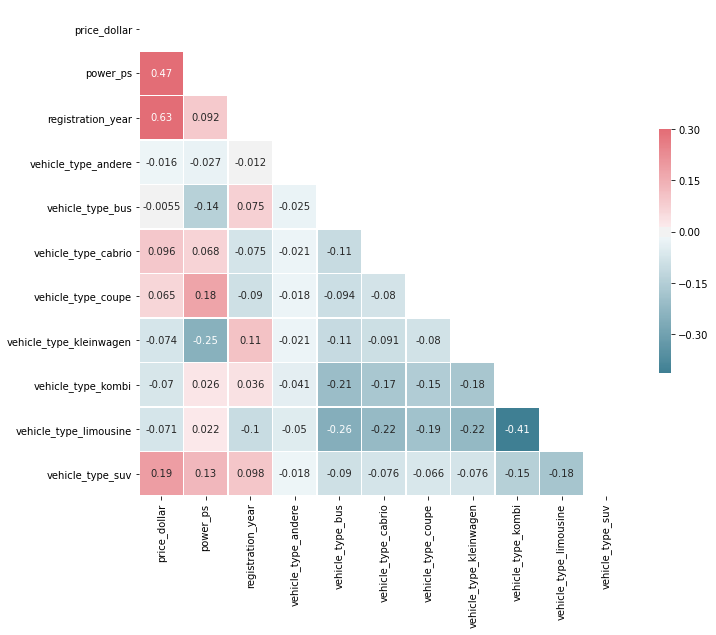

# eBay-Used-Car-Data-Analysis
Cars are well-known as having a high depreciation rate. Therefore, purchasing used car can usually be economically more favorable for many people. eBay Kleinanzeigen is a classfied advertising section of the German eBay website. Here I will work with a dataset which was orinigally scraped from eBay Kleinanzeigen, for the used car sell information. My goals are to:

- identify which brand should a customer consider first, based on the popularity and the price.
- generate a predictive model using linear regression to predict the prices of used cars with most popular brands.

## Code and Resources Used

**Python Version**: 3.7

**Packages**: pandas, numpy 

**Data Source**: https://www.kaggle.com/orgesleka/used-cars-database/data

## Data Cleaning
The following data cleaning steps were applied:
- Removed irrelevant columns
- Removed missing data
- Converted price from string like '$5,000' to float number
- Converted odometer reading from string like '1,000 km' to float number
- Removed outliers in price, odometer reading, registration year, and power
- Removed odometer reading for final model building as it contains significant number of same values

## EDA
I examined the correlations between the variables I chose for model building. Below is a summary:

# Model Building
I built models that can predict prices for used cars of specific vehicle types with brands BMW, Volkswagen, and Benz (the top popular brands in used cars).
